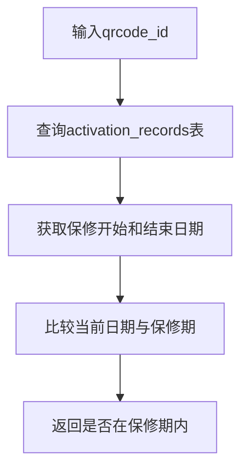

### **一、系统概述**
本系统旨在追踪产品的生命周期，从生产到销售再到用户激活。通过二维码技术实现唯一标识管理，并提供出货记录、激活记录及保修状态查询等功能。

---

### **二、核心功能模块**
1. **产品信息管理**
    - 录入产品基础信息（名称、型号、规格等）。
2. **二维码生成**
    - 为每个产品生成唯一的二维码。
3. **出货管理**
    - 记录产品出货时间及经销商信息。
4. **产品激活**
    - 用户扫码后输入个人信息完成激活，自动生成保修期。
5. **保修状态查询**
    - 查询产品是否在保修期内。
6. 维修管理
    1. 维修记录：绑定产品id，维修原因，时间，处理结果
    2. 查询
7. **安全与扩展**
    - 确保数据安全，支持批量操作及未来功能扩展。

---

### **三、关键逻辑流程图**

#### **1. 产品类型登记流程**

#### **2. 二维码生成流程**

#### **3. 出货记录流程**

#### **4. 产品激活流程**

#### **5. 保修状态查询流程**

---

### **五、API接口设计**
使用Django作为后端技术架构，使用rest_framework为api风格，认证使用rest_framework_simple,数据库使用postgresql。包含数据模型：产品类型表，代理商表，产品二维码表，操作记录表，维系记录表。

#### **创建新产品类型**
#### **生成产品二维码(单个或批量)**
#### **发货记录**
**批量输入二维码，同一批一起绑定其发送的时间和代理商**

#### ** 激活产品 - 产品二维码表上添加开始使用时间，真实客户信息**
#### **查询保修状态 - 可以通过客户邮箱，手机，生命**
#### **维修登记 - 绑定产品id，记录维修时间，原因，处理方式，**
#### **操作记录登记**
### **六、页面功能**
+ 使用HTTPS加密通信。
+ 实现用户认证和授权机制-JWT。
+ 发货操作-批量记录产品id，对应发货代理商，当前日期
+ 激活产品页面，通过客户上传图片识别产品二维码id协助填写，再让填写客户相关信息
+ 操作记录查询

#### **七、功能扩展建议**
+ 批量生成产品id和对应二维码脚本：支持一次性生成多个产品二维码。
+ 微信小程序扫码激活：集成微信生态。
+ 图片识别激活：支持OCR识别激活信息。

